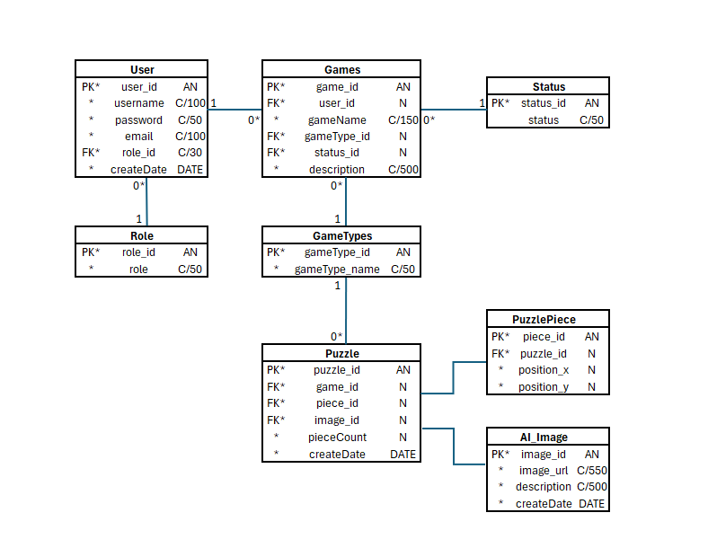

# Selainpeli

Tiimi: Jenna Räihä, Sakari Arasola, Heli Kyllinen

## Johdanto

Teemme pelisivuston, missä käyttäjä voi muun muassa koota palapelejä lisätyssä todellisuudessa käyttäen tekoälyn luomia kuvia. Pelit on tarkoitettu kaikille peleistä kiinnostuneille ja erityisesti niille, jotka etsivät viihdettä täyttääkseen tylsät ajankohdat arjessaan. Projektin edetessä tarkoituksemme on luoda pelisivusto, joka sisältää monenlaisia pelejä palapelistä tasohyppelyyn, mutta aloitamme sivuston kunnianhimoisesti luomalla palapelin, joka hyödyntää tekoälyä ja AR-teknologiaa samanaikaisesti. 

Sovellus on toteutettu käyttäen Spring Bootia, joka vastaa palvelinpuolen logiikasta ja REST-rajapintojen tarjoamisesta. Sovellus käyttää relaatiotietokantaa, kuten MariaDB:tä pelien, käyttäjien ja sessiotietojen tallentamiseen. Lisäksi sovelluksessa hyödynnetään ulkoisia tekoälypalveluja, kuten DALL·E:tä luomaan käyttäjän syötteen perusteella palapelin kuvat. Käyttöliittymä on selainpohjainen ja toteutettu HTML, CSS ja JavaScriptin avulla. Lisätyn todellisuuden (AR) ominaisuudet toteutetaan käyttämällä WebXR APIa tai AR.js-kirjastoa, mikä mahdollistaa AR-kokemuksen suoraan selaimessa ilman lisäohjelmistoja.

## Järjestelmän määrittely

Määrittelyssä järjestelmää tarkastellaan käyttäjän näkökulmasta. Järjestelmän
toiminnot hahmotellaan käyttötapausten tai käyttäjätarinoiden kautta, ja kuvataan järjestelmän
käyttäjäryhmät.

-   Lyhyt kuvaus käyttäjäryhmistä (rooleista)
-   Käyttäjäroolit ja roolien tarvitsemat toiminnot, esim. käyttötapauskaaviona
    (use case diagram) tai käyttäjätarinoina.
-   Lyhyt kuvaus käyttötapauksista tai käyttäjätarinat

Kuvauksissa kannattaa harkita, mikä on toteuttajalle ja asiakkaalle oleellista
tietoa ja keskittyä siihen.

#### Admin

- On vastuussa pelisivuston hallinnasta ja ylläpidosta
- Tarvittavat toiminnot:
    - hallinnoi käyttäjiä
        - luonti
        - päivitys
        - poisto
    - päivittää sivuston asetuksia

#### Kehittäjä

- Kehittää pelejä pelisivustolle
- Tarvittavat toiminnot:
    - pelin lisäys sivustolle
    - pelin päivitys tai poisto

#### Käyttäjä

- Pelaa pelejä pelisivustolla
- Tarvittavat toiminnot:
    - sivustolle kirjautuminen
    - pelien selaaminen
    - pelin pelaaminen
    - seuraa omia suorituksia ja saavutuksia

## Käyttöliittymä

Esitetään käyttöliittymän tärkeimmät (vain ne!) näkymät sekä niiden väliset siirtymät käyttöliittymäkaaviona. 

Jos näkymän tarkoitus ei ole itsestään selvä, se pitää kuvata lyhyesti.

## Tietokanta

Järjestelmään säilöttävä ja siinä käsiteltävät tiedot ja niiden väliset suhteet
kuvataan käsitekaaviolla. Käsitemalliin sisältyy myös taulujen välisten viiteyhteyksien ja avainten
määritykset. Tietokanta kuvataan käyttäen jotain kuvausmenetelmää, joko ER-kaaviota ja UML-luokkakaaviota.

Lisäksi kukin järjestelmän tietoelementti ja sen attribuutit kuvataan
tietohakemistossa. Tietohakemisto tarkoittaa yksinkertaisesti vain jokaisen elementin (taulun) ja niiden
attribuuttien (kentät/sarakkeet) listausta ja lyhyttä kuvausta esim. tähän tyyliin:

> ### _Tilit_
> _Tilit-taulu sisältää käyttäjätilit. Käyttäjällä voi olla monta tiliä. Tili kuuluu aina vain yhdelle käyttäjälle._
>
> Kenttä | Tyyppi | Kuvaus
> ------ | ------ | ------
> id | int PK | Tilin id
> nimimerkki | varchar(30) |  Tilin nimimerkki
> avatar | int FK | Tilin avatar, viittaus [avatar](#Avatar)-tauluun
> kayttaja | int FK | Viittaus käyttäjään [käyttäjä](#Kayttaja)-taulussa

## Tekninen kuvaus

Teknisessä kuvauksessa esitetään järjestelmän toteutuksen suunnittelussa tehdyt tekniset
ratkaisut, esim.

-   Missä mikäkin järjestelmän komponentti ajetaan (tietokone, palvelinohjelma)
    ja komponenttien väliset yhteydet (vaikkapa tähän tyyliin:
    https://security.ufl.edu/it-workers/risk-assessment/creating-an-information-systemdata-flow-diagram/)
-   Palvelintoteutuksen yleiskuvaus: teknologiat, deployment-ratkaisut yms.
-   Keskeisten rajapintojen kuvaukset, esimerkit REST-rajapinta. Tarvittaessa voidaan rajapinnan käyttöä täsmentää
    UML-sekvenssikaavioilla.
-   Toteutuksen yleisiä ratkaisuja, esim. turvallisuus.

Tämän lisäksi

-   ohjelmakoodin tulee olla kommentoitua
-   luokkien, metodien ja muuttujien tulee olla kuvaavasti nimettyjä ja noudattaa
    johdonmukaisia nimeämiskäytäntöjä
-   ohjelmiston pitää olla organisoitu komponentteihin niin, että turhalta toistolta
    vältytään

## Testaus

Tässä kohdin selvitetään, miten ohjelmiston oikea toiminta varmistetaan
testaamalla projektin aikana: millaisia testauksia tehdään ja missä vaiheessa.
Testauksen tarkemmat sisällöt ja testisuoritusten tulosten raportit kirjataan
erillisiin dokumentteihin.

Tänne kirjataan myös lopuksi järjestelmän tunnetut ongelmat, joita ei ole korjattu.

## Asennustiedot

Järjestelmän asennus on syytä dokumentoida kahdesta näkökulmasta:

-   järjestelmän kehitysympäristö: miten järjestelmän kehitysympäristön saisi
    rakennettua johonkin toiseen koneeseen

-   järjestelmän asentaminen tuotantoympäristöön: miten järjestelmän saisi
    asennettua johonkin uuteen ympäristöön.

Asennusohjeesta tulisi ainakin käydä ilmi, miten käytettävä tietokanta ja
käyttäjät tulee ohjelmistoa asentaessa määritellä (käytettävä tietokanta,
käyttäjätunnus, salasana, tietokannan luonti yms.).

## Käynnistys- ja käyttöohje

Tyypillisesti tässä riittää kertoa ohjelman käynnistykseen tarvittava URL sekä
mahdolliset kirjautumiseen tarvittavat tunnukset. Jos järjestelmän
käynnistämiseen tai käyttöön liittyy joitain muita toimenpiteitä tai toimintajärjestykseen liittyviä asioita, nekin kerrotaan tässä yhteydessä.

Usko tai älä, tulet tarvitsemaan tätä itsekin, kun tauon jälkeen palaat
järjestelmän pariin !
