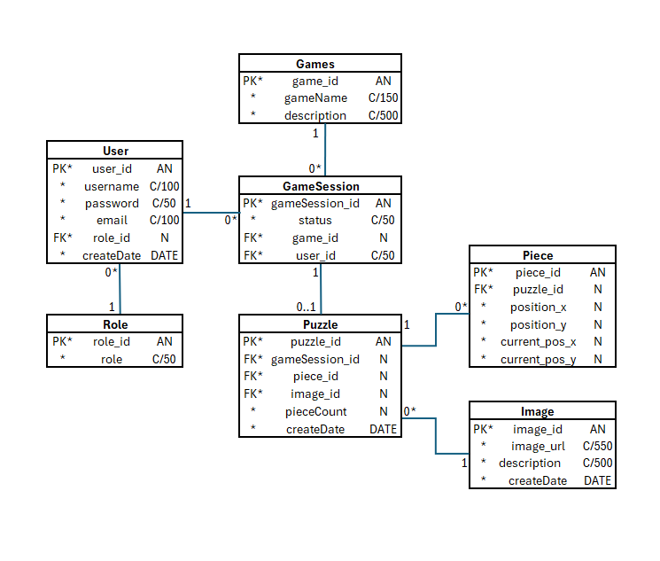

# Selainpeli

Tiimi: Jenna Räihä, Sakari Arasola, Heli Kyllinen

## Johdanto

### PalanPaikka – palapelien ystäville

PalanPaikka on käyttäjäystävällinen sovellus, jossa voit koota palapelejä helposti hakusanojen avulla. Sovellus on suunnattu kaikille palapeleistä kiinnostuneille – erityisesti heille, jotka etsivät hauskaa ja rentouttavaa tekemistä arjen kiireiden keskellä.

Alkuperäinen ideamme oli luoda pelialusta, joka tarjoaisi laajan valikoiman pelejä aina palapeleistä tasohyppelyihin. Kehitysprosessin myötä päätimme kuitenkin keskittyä yhteen ytimekkääseen kokemukseen, ja lopputuloksena syntyi PalanPaikka: sovellus, joka tuo palapelit kätesi ulottuville ulkoisen rajapinnan avulla. Projektin pääpaino oli myös kehitysprosessin hallinnassa, erityisesti omavetoisen Scrum-mallin hyödyntämisessä ja onnistuneessa projektinhallinnassa.

PalanPaikka on rakennettu käyttäen Spring Bootia, joka hoitaa palvelinpuolen logiikan ja REST-rajapintojen tarjoamisen. Sovellus hyödyntää Pixabay-rajapintaa, jonka avulla käyttäjä voi hakea palapelikuvia hakusanoilla.

Käyttöliittymä on selainpohjainen ja toteutettu HTML:n, Thymeleafin, CSS:n ja JavaScriptin avulla, mikä tekee sovelluksesta sekä visuaalisesti miellyttävän että toimivan eri laitteilla. Sovellus on julkaistu onnistuneesti Rahti-palvelussa, mikä tekee siitä helposti saavutettavan loppukäyttäjille. Lisäksi se hyödyntää Dockeria, joka mahdollistaa sovelluksen tehokkaan konttienhallinnan ja helpon käyttöönoton eri ympäristöissä.

PalanPaikka on onnistunut yhdistelmä luovuutta, teknologiaa ja huolellista projektinhallintaa – täydellinen valinta kaikille palapelifaneille!

## Järjestelmän määrittely

Määrittelyssä järjestelmää tarkastellaan käyttäjän näkökulmasta. Järjestelmän
toiminnot hahmotellaan käyttötapausten tai käyttäjätarinoiden kautta, ja kuvataan järjestelmän
käyttäjäryhmät.

-   Lyhyt kuvaus käyttäjäryhmistä (rooleista)
-   Käyttäjäroolit ja roolien tarvitsemat toiminnot, esim. käyttötapauskaaviona
    (use case diagram) tai käyttäjätarinoina.
-   Lyhyt kuvaus käyttötapauksista tai käyttäjätarinat

#### Käyttäjä

- Kokoaa palapelejä pelisivustolla
- Tarvittavat toiminnot:
    - sivustolle kirjautuminen
    - kuvan hakeminen
    - palapelin kokoaminen
    - koottujen kuvien selaaminen ja aikojen tarkastelu

## Käyttöliittymä

### Käyttöliittymäkaaviona:
- Aloitusnäkymä
- Pelivalikko
    - Pelinäkymä
- Käyttäjätili
- Admin-näkymä

### Aloitusnäkymä

### Kuvagalleria

## Tietokanta

Järjestelmään säilöttävä ja siinä käsiteltävät tiedot ja niiden väliset suhteet
kuvataan käsitekaaviolla. Käsitemalliin sisältyy myös taulujen välisten viiteyhteyksien ja avainten
määritykset. Tietokanta kuvataan käyttäen jotain kuvausmenetelmää, joko ER-kaaviota ja UML-luokkakaaviota.

Lisäksi kukin järjestelmän tietoelementti ja sen attribuutit kuvataan
tietohakemistossa. Tietohakemisto tarkoittaa yksinkertaisesti vain jokaisen elementin (taulun) ja niiden
attribuuttien (kentät/sarakkeet) listausta ja lyhyttä kuvausta esim. tähän tyyliin:

> ### _Selitykset_
> _Tässä on selitykset tietokannan taulujen tyypeille._
>
>  Tyyppi | Kuvaus
> ------ | ------ 
> PK | Pääavain
> FK |  Viiteavain
> "*" |  Pakollinen tieto
> AN | Autonumber/laskuri
> C/10 | Teksti/pituus
> N| Numero
> DATE | Päivämäärä

> ### _User_
> _User-taulu sisältää pelisivuston käyttäjät. Käyttäjällä voi olla vain yksi tili.
>
> Kenttä | Tyyppi | Kuvaus
> ------ | ------ | ------
> user_id | PK* AN | Käyttäjän idnumero
> username | *C/100 | Käyttäjänimi, jota käytetään pelisivustolla
> password | *C/50 | Salasana, jolla kirjaudutaan pelisivustolle
> email | *C/100 | Käyttäjän sähköpostiosoite
> role_id | FK *C/30 | Käyttäjän rooli sivustolla, viittaus [Role](#Role)-tauluun
> createDate | *DATE | Päivämäärä milloin käyttäjä on luotu

> ### _Role_
> _Role-taulu sisältää sivustolla olevat erilaiset käyttäjä-roolit._
>
> Kenttä | Tyyppi | Kuvaus
> ------ | ------ | ------
> role_id | PK* AN | Roolin idnumero
> role| *C/50 | Roolin nimi

> ### _Games_
> _Games-taulu sisältää kaikki sivuston eri pelit._
>
> Kenttä | Tyyppi | Kuvaus
> ------ | ------ | ------
> game_id | PK* AN | Pelin idnumero
> gameName| *C/50 | Pelin nimi
> description| *C/500 | Kuvaus pelistä

> ### _GameSession_
> _GameSession-taulu sisältää pelisession tiedot._
>
> Kenttä | Tyyppi | Kuvaus
> ------ | ------ | ------
> gameSession_id | PK* AN | Pelisession idnumero
> user_id | FK* N | Käyttäjän idnumero, viittaus [User](#User)-tauluun
> game_id | FK* N | Pelin idnumero, viittaus [Games](#Games)-tauluun
> status | * C/50 | Pelin status, kesken tai valmis

> ### _Puzzle_
> _Puzzle-taulu sisältää sivustolle luodun palapelin tiedot._
>
> Kenttä | Tyyppi | Kuvaus
> ------ | ------ | ------
> puzzle_id | PK* AN | Palapelin idnumero
> gameSession_id| FK* N | Pelisession idnumero, viittaus [GameSession](#GameSession)-tauluun
> piece_id| FK* N | Yksittäisen palapelin palan idnumero, viittaus [Piece](#Piece)-tauluun
> image_id| FK* N | Kuvan idnumero, viittaus [Image](#Image)-tauluun
> pieceCount| * N | Palapelin palojen määrä
> createDate | *DATE | Päivämäärä milloin palapeli on luotu

> ### _Piece_
> _Piece-taulu sisältää yksittäisen palapelin palan tiedot._
>
> Kenttä | Tyyppi | Kuvaus
> ------ | ------ | ------
> piece_id | PK* AN | Palapelin palan idnumero
> puzzle_id| FK* N | Palapelin idnumero, viittaus [Puzzle](#Puzzle)-tauluun
> position_x| * N | Palan vaakasuora sijainti (x-kordinaatti) 
> position_y| * N | Palan pystysuora sijainti (y-kordinaatti)
> current_pos_x| * N | Palan tämän hetkinen vaakasuora sijainti (x-kordinaatti) 
> current_pos_y| * N | Palan tämän hetkinen pystysuora sijainti (y-kordinaatti)

> ### _Image_
> _Image-taulu sisältää palapeliä varten luodun kuvan tiedot._
>
> Kenttä | Tyyppi | Kuvaus
> ------ | ------ | ------
> image_id | PK* AN | Luodun kuvan idnumero
> image_url| * C/550 | Kuvan url-osoite
> description| *C/500 | Kuvaus millä kuva on luotu
> createDate | *DATE | Päivämäärä milloin kuva on luotu

## Tekninen kuvaus

Teknisessä kuvauksessa esitetään järjestelmän toteutuksen suunnittelussa tehdyt tekniset
ratkaisut, esim.

-   Missä mikäkin järjestelmän komponentti ajetaan (tietokone, palvelinohjelma)
    ja komponenttien väliset yhteydet (vaikkapa tähän tyyliin:
    https://security.ufl.edu/it-workers/risk-assessment/creating-an-information-systemdata-flow-diagram/)
-   Palvelintoteutuksen yleiskuvaus: teknologiat, deployment-ratkaisut yms.
-   Keskeisten rajapintojen kuvaukset, esimerkit REST-rajapinta. Tarvittaessa voidaan rajapinnan käyttöä täsmentää
    UML-sekvenssikaavioilla.
-   Toteutuksen yleisiä ratkaisuja, esim. turvallisuus.

Tämän lisäksi

-   ohjelmakoodin tulee olla kommentoitua
-   luokkien, metodien ja muuttujien tulee olla kuvaavasti nimettyjä ja noudattaa
    johdonmukaisia nimeämiskäytäntöjä
-   ohjelmiston pitää olla organisoitu komponentteihin niin, että turhalta toistolta
    vältytään

## Testaus

Sovellukseen suoritettiin muutama Robot Framework -testaus osana Ojhelmistokehityksen teknologioita -kurssin seminaarityön osuutta:

Testit kirjautumiselle, pääsivun näyttämiselle, hakusanalle ja kuvan näyttämiselle ovat kaikki koostettuna tässä ui.robot-testitiedostossa:

## Asennustiedot

Järjestelmän asennus on syytä dokumentoida kahdesta näkökulmasta:

-   järjestelmän kehitysympäristö: miten järjestelmän kehitysympäristön saisi
    rakennettua johonkin toiseen koneeseen

-   järjestelmän asentaminen tuotantoympäristöön: miten järjestelmän saisi
    asennettua johonkin uuteen ympäristöön.

Asennusohjeesta tulisi ainakin käydä ilmi, miten käytettävä tietokanta ja
käyttäjät tulee ohjelmistoa asentaessa määritellä (käytettävä tietokanta,
käyttäjätunnus, salasana, tietokannan luonti yms.).

## Käynnistys- ja käyttöohje

Tyypillisesti tässä riittää kertoa ohjelman käynnistykseen tarvittava URL sekä
mahdolliset kirjautumiseen tarvittavat tunnukset. Jos järjestelmän
käynnistämiseen tai käyttöön liittyy joitain muita toimenpiteitä tai toimintajärjestykseen liittyviä asioita, nekin kerrotaan tässä yhteydessä.

Usko tai älä, tulet tarvitsemaan tätä itsekin, kun tauon jälkeen palaat
järjestelmän pariin !
